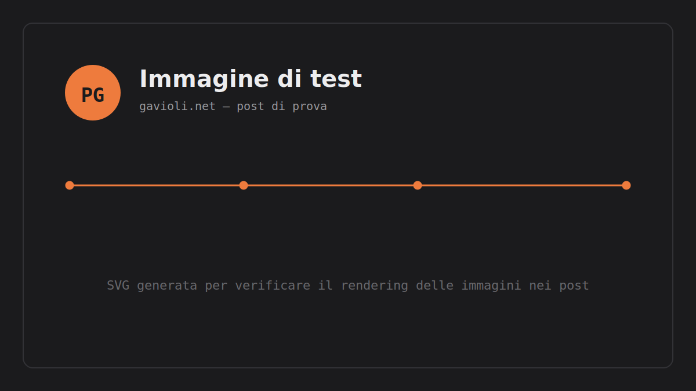

Questo è un post di prova, serve solo a verificare che le immagini dentro i contenuti del blog vengano renderizzate correttamente, path compresi.

Se vedi l'immagine sopra con il cerchio arancione "PG", il rendering funziona.
